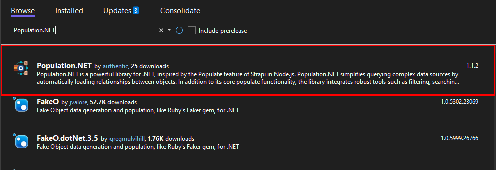

<p align="center">
  
</p>

<h1 align="center">Population.NET</h1>

# What is Population.NET?

Population.NET is a .NET library designed to simplify complex data manipulation and querying operations. Inspired by the [Populate feature of Strapi in Node.js](https://docs.strapi.io/dev-docs/api/rest/populate-select), it offers robust tools for sorting, filtering, and projecting data, enabling efficient handling of large datasets. With Population.NET, you can seamlessly build powerful and optimized APIs to meet the demands of modern applications.

## Main Features

- **Built-in BaseEntity Support**: Provides a built-in abstract `BaseEntity` class to simplify entity creation
- **QueryContext**: Provides a common **query params** request class for search APIs.
- **Simple Population**:  Easily retrieve and populate data with a simple and intuitive API, inspired by Strapi's populate feature.
- **Population with Filters, Search, Sort, and Paging**: Combine population capabilities seamlessly with filtering, searching, sorting, and pagination to handle complex data queries efficiently.

---

## ⏳ Installation

### Using Package Manager

To install **Population.NET** in using Using Package Manager, follow these steps:

1. Open **Visual Studio 2022**.
2. Go to **Tools** -> **NuGet Package Manager** -> **Manage NuGet Packages for Solution...**.
3. Search for `Population.NET` in the Browse tab and install the package.

<p align="left">
  
</p>

or

Add the following package reference to your project file:

```xml
<PackageReference Include="Population.NET" Version="1.1.2" />
```

### Using .NET CLI
Alternatively, install it via the .NET CLI:

```bash
dotnet add package Population.NET --version 1.1.2
```

---

## 🖐 Requirements

To use **Population.NET**, ensure the following requirements are met:

1. **Using .NET 8 or higher**  
   Make sure your project is targeting **.NET 8** or a newer version. You can set the target framework in your `.csproj` file:

   ```xml
   <TargetFramework>net8.0</TargetFramework>

2. **AutoMapper Configuration**
   Configure AutoMapper in your project to handle object mapping. Below is a simple example of how to set up AutoMapper:
   
    ```csharp
    using AutoMapper;

    public class MappingProfile : Profile
    {
        public MappingProfile()
        {
            // Example mapping configuration
            CreateMap<Entity, Response>();
        }
    }
    ```
    Then, register the mapping configuration in your project (e.g., in Program.cs):
    
    ```csharp
    var mapperConfig = new MapperConfiguration(cfg => 
    {
        cfg.AddProfile<MappingProfile>();
    });

    IMapper mapper = mapperConfig.CreateMapper();
    builder.Services.AddSingleton(mapper);
    ```
    or

    ```csharp
    builder.Services.AddAutoMapper(typeof(ProfileAssemblyType))
    ```

---

## 🚀 Usage Example

1. **Built-in BaseEntity Support**

    **Population.NET** provides a built-in abstract `BaseEntity` class to simplify entity creation. It supports automatic ID generation and creation timestamps.
    
    ```csharp
    public abstract class BaseEntity : BaseEntity<Guid>, IGuidIdentify
    {
        protected BaseEntity() => Id = NewId.Next().ToGuid();
    }

    public abstract class BaseEntity<TId> : IEntity<TId>
    {
        public TId Id { get; set; } = default!;
        public virtual DateTimeOffset CreatedAt { get; set; } = DateTimeOffset.UtcNow;
    }
    ```

 > **Note:** Before diving into the next steps, let's create the necessary **models** and their corresponding **response DTOs**.

- **Create Models**

    ```csharp
    public class User : BaseEntity
    {
        public string Name { get; set; } = default!;

        public string Email { get; set; } = default!;

        public string UserName { get; set; } = default!;

        public string Password { get; set; } = default!;

        public UserOperationStatus Status { get; set; } = UserOperationStatus.Active;

        public Guid RoleId { get; set; }

        public Role? Role { get; set; }
    }

    public enum UserOperationStatus
    {
        /// <summary>
        /// Active
        /// </summary>
        Active = 1,

        /// <summary>
        /// Locked
        /// </summary>
        Locked = 2,
    }
    ```

    ```csharp
    public class Role : BaseEntity
    {
        public string Name { get; set; } = default!;

        public string? Description { get; set; }

        public ICollection<User> Users { get; set; } = default!;

        public ICollection<Permission> Permissions { get; set; } = default!;
    }
    ```

    ```csharp
    public class Permission : BaseEntity
    {
        public string Code { get; set; } = default!;

        public string Name { get; set; } = default!;

        public Guid RoleId { get; set; }

        public Role? Role { get; set; }
    }

    ```
- **Create response DTOs**
    ```csharp
    public class UserResponse : BaseEntity
    {
        public string Name { get; set; } = default!;

        public string Email { get; set; } = default!;

        public string UserName { get; set; } = default!;

        public string Password { get; set; } = default!;

        public UserOperationStatus Status { get; set; } = UserOperationStatus.Active;

        public RoleResponse? Role { get; set; }
    }
    ```
    
    ```csharp
    public class RoleResponse : BaseEntity
    {
        public string Name { get; set; } = default!;

        public string? Description { get; set; }

        public ICollection<PermissionResponse> Permissions { get; set; } = default!;
    }
    ```

    
    ```csharp
    public class PermissionResponse : BaseEntity
    {
        public string Code { get; set; } = default!;

        public string Name { get; set; } = default!;
    }
    ```

- **Config mapping**

    ```csharp
    public class MappingProfile : Profile
    {
        public MappingProfile()
        {
            CreateMap<User, UserResponse>();
            CreateMap<Role, RoleResponse>();
            CreateMap<Permission, PermissionResponse>();
        }
    }
    ```

- **Prepare Test Data**

    Let’s create a simple API for **creating users** and use the provided test data.

    ```csharp
    [HttpPost]
    public async Task<IActionResult> CreateAsync([FromBody] CreateUserRequest request)
    {
        User user = mapper.Map<User>(request);
        await context.Users.AddAsync(user);
        await context.SaveChangesAsync();
        return Ok();
    }
    ```

    **Example JSON Payload**

    ```json
    {
      "name": "John Doe",
      "email": "john.doe@example.com",
      "userName": "johndoe123",
      "password": "Password@123",
      "status": 1,
      "role": {
        "name": "Admin",
        "description": "Administrator role with full access",
        "permissions": [
               {
                  "code": "READ",
                  "name": "Read Access"
               },
               {
                  "code": "WRITE",
                  "name": "Write Access"
               }
            ]
        }
    }
    ```
    
    ```json
    {
       "name": "Jane Smith",
       "email": "jane.smith@example.com",
       "userName": "janesmith456",
       "password": "SecurePass@2024",
       "status": 1,
       "role": {
        "name": "Editor",
        "description": "Editor role with limited access",
        "permissions": [
                {
                    "code": "UPDATE",
                    "name": "Update Access"
                }
            ]
        }
    }
    ```
---

2. **Simple Population**

    ### Normally
    We will create a simple **GET API** to fetch all users using AutoMapper's `ProjectTo` method.

    ```csharp
    [HttpGet("UsingProjectTo")]
    public async Task<IActionResult> GetAllAsync()
    {
        List<UserResponse> response = await context.Users
            ProjectTo<UserResponse>(mapper.ConfigurationProvider)
            .ToListAsync();

        return Ok(response);
    }
    ```

    By default, when using ProjectTo from AutoMapper without additional filtering, the data returned will include all properties defined in the **response DTOs** class. This behavior can lead to overfetching of data, especially when the response class contains nested relationships or unnecessary fields.

    ```json
    [
        {
            "name": "John Doe",
            "email": "john.doe@example.com",
            "userName": "johndoe123",
            "password": "Password@123",
            "status": 1,
            "role": {
                "name": "Admin",
                "description": "Administrator role with full access",
                "permissions": [
                        {
                        "code": "READ",
                        "name": "Read Access",
                        "id": "74850000-9961-b42e-8d36-08dd1e75109e",
                        "createdAt": "2024-12-17T08:30:29.531166+00:00"
                        },
                        {
                        "code": "WRITE",
                        "name": "Write Access",
                        "id": "74850000-9961-b42e-90f7-08dd1e75109e",
                        "createdAt": "2024-12-17T08:30:29.531262+00:00"
                        }
                    ],
                    "id": "74850000-9961-b42e-baae-08dd1e75109d",
                    "createdAt": "2024-12-17T08:30:29.525732+00:00"
                },
            "id": "74850000-9961-b42e-a80d-08dd1e75109d",
            "createdAt": "2024-12-17T08:30:29.463949+00:00"
        },
        ...
    ]
    ```

    ## Using population

    Create **GET API** to fetch all users using AutoMapper's `ProjectDynamic` method.

    ```csharp
    [HttpGet("SimplePopulation")]
    public async Task<IActionResult> GetAllWithSimplePopulationAsync([FromQuery] QueryContext queryContext)
    {
        List<dynamic> response = await context.Users
            .ProjectDynamic<UserResponse>(mapper, queryContext.Populate)
            .ToListAsync();

        return Ok(response);
    }
    ```
    
    1. 🔥 **Field Selection**

    Queries can accept a `fields` parameter to select only specific fields. By default, only the following types of fields are returned:

    - **String types**: string, uuid, ...
    - **Date types**: DateTime, DateTimeOffset, ....
    - **Number types**: integer, long, float, and decimal.
    - **Generic types**: boolean, array of primitive types.

    ### Example Use Cases

    | **Use case**               | **Example parameter syntax**                    |
    |--------------------------- |-------------------------------------------------|
    | Select a single field      | `fields=name`                                   |
    | Select multiple fields     | `fields=name&fields=Email`                      |
    | Select populate and fields | `populate[Role][fields]=name`                   |


    > **Note:** Field selection does not work on relational. To populate these fields, use the `populate` parameter.
    

    **Example Request: Return only name, description, Role.Name fields**

    ```http
    GET /api/User/SimplePopulation?fields=name&fields=Email&populate[Role][fields]=name
    ```

    **Example Response:**

    ```json
    [
        {
            "name": "John Doe",
            "email": "john.doe@example.com",
            "role": {
                "name": "Admin"
            }
        },
        {
            "name": "Jane Smith",
            "email": "jane.smith@example.com",
            "role": {
                "name": "Editor"
            }
        }
    ]
    ```

    2. 🔥 **Without populate**

    Without the `populate` parameter, a `GET` request will only return the default fields and will not include any related data.

    **Example Request:**

     ```http
    GET /api/User/SimplePopulation
    ```

    **Example Response:**

     ```json
     [
        {
            "name": "John Doe",
            "email": "john.doe@example.com",
            "userName": "johndoe123",
            "password": "Password@123",
            "status": 1,
            "id": "74850000-9961-b42e-a80d-08dd1e75109d",
            "createdAt": "2024-12-17T08:30:29.463949+00:00"
        },
        ...
    ]
     ```

    3. 🔥 **Populate all relations and fields, 1 level deep**

    You can return all fields and relations. For relations, this will only work 1 level deep, to prevent performance issues and long response times.

    To populate everything 1 level deep, add the `populate=*` parameter to your query.

    **Example Request:**

    ```http
    GET /api/User/SimplePopulation?populate=*
    ```

    **Example Response:**

     ```json
     [
        {
            "name": "John Doe",
            "email": "john.doe@example.com",
            "userName": "johndoe123",
            "password": "Password@123",
            "status": 1,
            "id": "74850000-9961-b42e-a80d-08dd1e75109d",
            "createdAt": "2024-12-17T08:30:29.463949+00:00",
            "role": {
                "name": "Admin",
                "description": "Administrator role with full access",
                "id": "74850000-9961-b42e-baae-08dd1e75109d",
                "createdAt": "2024-12-17T08:30:29.525732+00:00"
            }
        },
        ...
    ]
     ```

    > **Note:** If your data includes additional relationships beyond `role`, such as `organization`, or `groups` using the `populate=*` parameter will also include those relationships as long as they are at a depth of 1

    4. 🔥 **Populate specific relations and fields**

    You can also `populate` specific relations and fields, by explicitly defining what to populate. This requires that you know the name of fields and relations to populate.

    > **Note:** Relations and fields populated this way can be 1 or several levels deep

    ### Similar Parameter Syntax Examples

    | **Example parameter syntax** | 
    |------------------------------|
    | `populate=role`              |
    | `populate[role]=true`        |
    | `populate[role]=*`           |

    **Example Request:**

    ```http
    GET /api/User/SimplePopulation?populate=role
    ```

    **Example Response:**
    ```json
    [
        {
            "name": "John Doe",
            "email": "john.doe@example.com",
            "userName": "johndoe123",
            "password": "Password@123",
            "status": 1,
            "id": "74850000-9961-b42e-a80d-08dd1e75109d",
            "createdAt": "2024-12-17T08:30:29.463949+00:00",
            "role": {
                "name": "Admin",
                "description": "Administrator role with full access",
                "id": "74850000-9961-b42e-baae-08dd1e75109d",
                "createdAt": "2024-12-17T08:30:29.525732+00:00"
            }
        },
        ...
    ]
    ```

    ### Populate fields and relationships at a depth greater than 1 level

    **Similar Parameter Syntax Examples**

    |        **Example parameter syntax**         | 
    |---------------------------------------------|
    | `populate[role][populate]=permissions`      |
    | `populate[role][populate][permissions]=true`|
    | `populate[role][populate][permissions]=*`   |


<br>
    > ⚠️ **Note:**  
    > Documentation for **Filters, Search, Sort, and Paging** is still under development.  
    > In the meantime, you can refer to the relevant sections in [Strapi Documentation](https://docs.strapi.io/dev-docs/api/rest).
</br>

## Contributing

Contributions are welcome! Feel free to submit a pull request or open an issue to discuss any changes or improvements.

---

## License

This project is licensed under the **MIT License**. See the [LICENSE](LICENSE) file for more details.

---

## Authors

- **Authentic**

---

## Acknowledgements

Population.NET seamlessly integrates with:

- [AutoMapper](https://automapper.org/)
- [Entity Framework Core](https://docs.microsoft.com/en-us/ef/core/)

---

*For more detailed documentation and examples, refer to the official documentation.*
